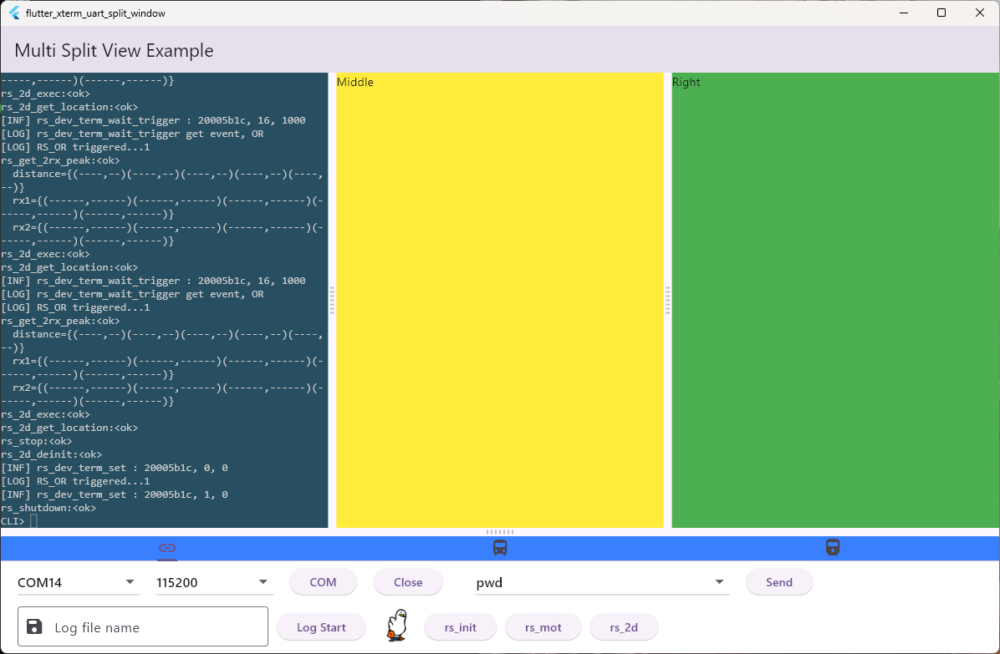

# flutter_xterm_uart_split_window

Split window with xterm terminal view which can connec to uart
User can add what you want to middle/right screen or increase more windows.

## Getting Started

xterm window + user window + chart window and so on
multi_split_view + xterm + flutter_libserial + pty

## TODO

- pty running on xterm
  - it was work before without an issue but there happenning key input related errors so currently, pty feature disabled.

## History

- 2025.12.02
  - Basic feature is working

## Info

- Author : Louie Yang
- Flutter 3.35.7 • channel stable • https://github.com/flutter/flutter.git
Framework • revision adc9010625 (6 weeks ago) • 2025-10-21 14:16:03 -0400
Engine • hash 6b24e1b529bc46df7ff397667502719a2a8b6b72 (revision 035316565a) (1 months ago) • 2025-10-21 14:28:01.000Z
Tools • Dart 3.9.2 • DevTools 2.48.0
